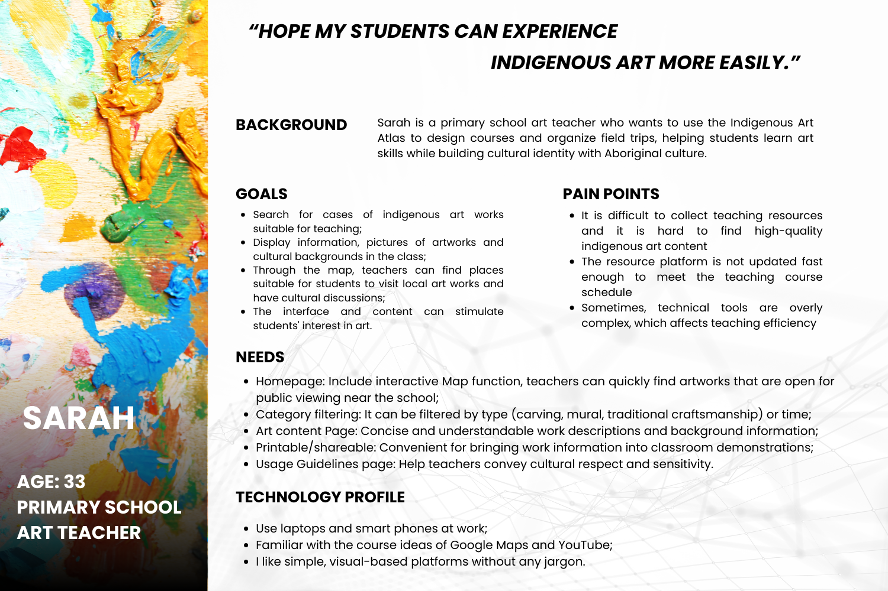
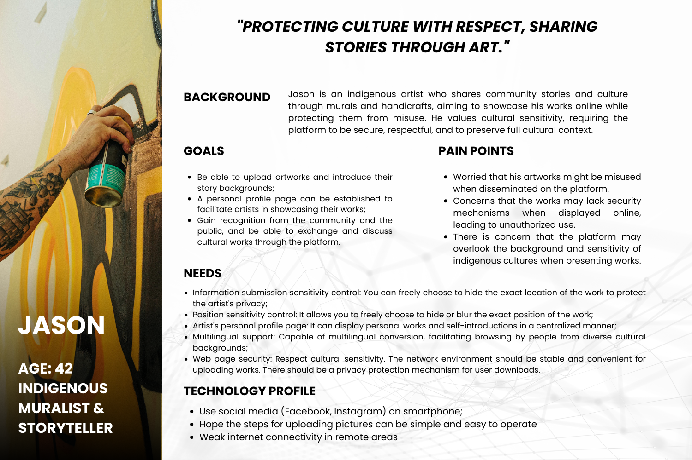

# HF City Team 5 – Cycle 1 UX Design Report 

## 1. User Personas

### Persona 1

    Name: Sarah
    Age: 33
    Occupation: Adelaide Primary School Art Teacher
    Location: Adelaide Suburbs

### Persona Images

#### Technology Profile:
* Uses laptop at work and smartphone daily;
* Familiar with Google Maps, YouTube for lesson ideas;
* Prefers simple, visual-based platforms without any jargon.

#### Background:

Sarah is a primary school art teacher. In her teaching plan for this semester, she needs to design courses to help students better understand the Aboriginal culture of Australia. She hopes that while imparting art skills, she can also help students establish a sense of identity with indigenous cultures. She hopes to find real and teaching-suitable Art cases through the Indigenous Art Atlas website and arrange class field trips. She needs to plan the courses based on this website, so the website should have the characteristics of being efficient to use, reliable in information and oriented towards educators.

#### Goals: 
* Search for cases of indigenous art works suitable for teaching;
* Display information, pictures of artworks and cultural backgrounds in the class;
* Through the map, teachers can find places suitable for students to visit local art works and have cultural discussions;
* The interface and content can stimulate students' interest in art.

#### Needs:
* Homepage: Include interactive Map function, teachers can quickly find artworks that are open for public viewing near the school;
* Category filtering: It can be filtered by type (carving, mural, traditional craftsmanship) or time;
* Art content Page: Concise and understandable work descriptions and background information;
* Printable/shareable: Convenient for bringing work information into classroom demonstrations;
* Usage Guidelines page: Help teachers convey cultural respect and sensitivity.

#### Pain Points
* It is difficult to collect teaching resources and it is hard to find high-quality indigenous art content
* The resource platform is not updated fast enough to meet the teaching course schedule
* Sometimes, technical tools are overly complex, which affects teaching efficiency

#

### Persona 2
    Name: Jason
    Age: 42
    Occupation: Indigenous muralist & storyteller
    Location: Regional South Australia

### Persona Images

#### Technology Profile:
* Use social media (Facebook, Instagram) on smartphone;
* Hope the steps for uploading pictures can be simple and easy to operate
* Weak internet connectivity in remote areas

#### Background:
Jason is an indigenous artist who documents the stories and cultures of indigenous communities through murals and handicrafts. He hopes to display his works online, allowing more people to see his creations and at the same time protect the culture from being misused. He values cultural sensitivity and does not wish for art to be commercialized or disseminated deviated from its original meaning. He has very high requirements for the security and respectful attitude of the platform and hopes that the uploaded works can retain complete cultural background explanations.

#### Goals: 
* Be able to upload artworks and introduce their story backgrounds;
* A personal profile page can be established to facilitate artists in showcasing their works;
* Gain recognition from the community and the public, and be able to exchange and discuss cultural works through the platform.

#### Needs:
* Information submission sensitivity control: You can freely choose to hide the exact location of the work to protect the artist's privacy;
* Position sensitivity control: It allows you to freely choose to hide or blur the exact position of the work;
* Artist's personal profile page: It can display personal works and self-introductions in a centralized manner;
* Multilingual support: Capable of multilingual conversion, facilitating browsing by people from diverse cultural backgrounds;
* Web page security: Respect cultural sensitivity. The network environment should be stable and convenient for uploading works. There should be a privacy protection mechanism for user downloads.

#### Pain points
* Worried that his artworks might be misused when disseminated on the platform.
* Concerns that the works may lack security mechanisms when displayed online, leading to unauthorized use.
* There is concern that the platform may overlook the background and sensitivity of indigenous cultures when presenting works.

## 2. Key User Tasks and Flows

Written by **Member B – User Flow Designer**

Identify at least 3 key user tasks. For each task, provide a short description and include a flow diagram image.

### Task 1: [Register and Login]
- Description: ...
- Flow diagram: 

### Task 2: [Browse and Select Artworks]
- Description: ...
- Flow diagram: 

### Task 3: [Submit New Artwork]
- Description: ...
- Flow diagram: 

## 3. Information Architecture (Sitemap)

Provided collaboratively.

Provide a visual sitemap representing the structure of your website.

## 4. Low-Fidelity Wireframes

Written by **Member C – Wireframe Designer**

Include 2–3 wireframes representing key pages.

### Wireframe 1 – Homepage

### Wireframe 2 – Upload Page

### Wireframe 3 – User Center

## 5. Accessibility and Usability Considerations

Provided collaboratively.

List 3–5 design features supporting accessibility and usability.

## 6. Design Rationale

Written by **Member A – Rationale Writer**

Explain major design decisions and how they address personas’ goals and usability principles.

## 7. User Research and Evidence

Written by **Member A**

Briefly explain what user research methods were used and what insights were gained.

## 8. Known Limitations and Future Improvements

Written by **Member D – Project Coordinator**

List current limitations and outline what will be improved in Cycle 2.

## 9. Team Contributions

Coordinated by **Member D – Project Coordinator & Git Manager**

| Name       | Role                          | Contributions                            |
|------------|-------------------------------|-------------------------------------------|
| A          | User Research & Rationale     | Personas, needs analysis, rationale       |
| B          | User Flow Designer            | Task flows, logic diagrams                |
| C          | Wireframe Designer            | Page wireframes with annotations          |
| D (Leader) | Project Coordinator & Git     | Git setup, report integration, final review |

## 10. AI Acknowledgment (if used)

State any AI tools used and include Appendix A if applicable.

## Appendix A – AI Prompt History (If applicable)

Include full prompt history and outputs here.