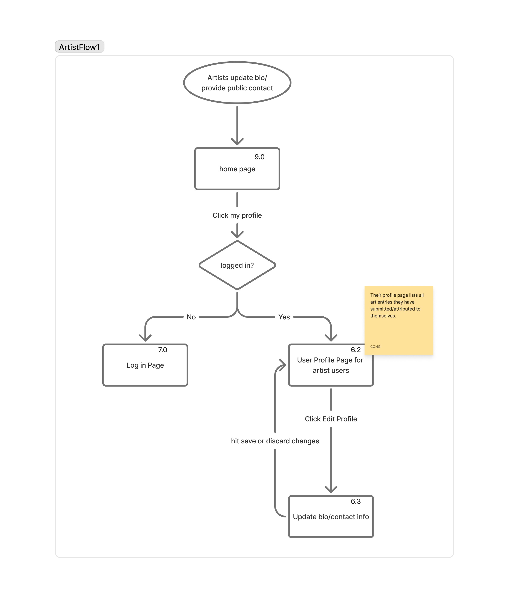

# HF City Team 5 – Cycle 1 UX Design Report 

## 1. User Personas

### Persona 1

    Name: Sarah
    Age: 33
    Occupation: Adelaide Primary School Art Teacher
    Location: Adelaide Suburbs

### Persona Images

> Persona_Sarah.png is stored under `./imgs/` for traceability.

#### Technology Profile:
* Uses laptop at work and smartphone daily;
* Familiar with Google Maps, YouTube for lesson ideas;
* Prefers simple, visual-based platforms without any jargon.
* #### Quantified Usage Patterns:
- **Daily technology time**: 4 hours (work laptop), 2 hours (personal phone)
- **Resource search frequency**: 2-3 times per week, 15-20 minutes per session
- **Class preparation**: Requires 6-8 cultural art examples per semester
- **Budget constraints**: $200 annual allocation for educational resources

#### Background:

Sarah is a primary school art teacher. In her teaching plan for this semester, she needs to design courses to help students better understand the Aboriginal culture of Australia. She hopes that while imparting art skills, she can also help students establish a sense of identity with indigenous cultures. She hopes to find real and teaching-suitable Art cases through the Indigenous Art Atlas website and arrange class field trips. She needs to plan the courses based on this website, so the website should have the characteristics of being efficient to use, reliable in information and oriented towards educators.

#### Goals: 
* Search for cases of indigenous art works suitable for teaching;
* Display information, pictures of artworks and cultural backgrounds in the class;
* Through the map, teachers can find places suitable for students to visit local art works and have cultural discussions;
* The interface and content can stimulate students' interest in art.

#### Needs:
* Homepage: Include interactive Map function, teachers can quickly find artworks that are open for public viewing near the school;
* Category filtering: It can be filtered by type (carving, mural, traditional craftsmanship) or time;
* Art content Page: Concise and understandable work descriptions and background information;
* Printable/shareable: Convenient for bringing work information into classroom demonstrations;
* Usage Guidelines page: Help teachers convey cultural respect and sensitivity.

#### Pain Points
* It is difficult to collect teaching resources and it is hard to find high-quality indigenous art content
* The resource platform is not updated fast enough to meet the teaching course schedule
* Sometimes, technical tools are overly complex, which affects teaching efficiency

#

### Persona 2
    Name: Jason
    Age: 42
    Occupation: Indigenous muralist & storyteller
    Location: Regional South Australia

### Persona Images

> Persona_Jason.png is stored under `./imgs/` for traceability.

#### Technology Profile:
* Use social media (Facebook, Instagram) on smartphone;
* Hope the steps for uploading pictures can be simple and easy to operate
* Weak internet connectivity in remote areas
* #### Technical Constraints:
- **Upload frequency**: 2-3 artworks per month during peak seasons
- **Network limitations**: Unstable rural connectivity affects usage timing
- **Device usage**: 80% mobile, 20% community center computers
- **Privacy concerns**: High - requires granular control over cultural content sharing

#### Background:
Jason is an indigenous artist who documents the stories and cultures of indigenous communities through murals and handicrafts. He hopes to display his works online, allowing more people to see his creations and at the same time protect the culture from being misused. He values cultural sensitivity and does not wish for art to be commercialized or disseminated deviated from its original meaning. He has very high requirements for the security and respectful attitude of the platform and hopes that the uploaded works can retain complete cultural background explanations.

#### Goals: 
* Be able to upload artworks and introduce their story backgrounds;
* A personal profile page can be established to facilitate artists in showcasing their works;
* Gain recognition from the community and the public, and be able to exchange and discuss cultural works through the platform.

#### Needs:
* Information submission sensitivity control: You can freely choose to hide the exact location of the work to protect the artist's privacy;
* Position sensitivity control: It allows you to freely choose to hide or blur the exact position of the work;
* Artist's personal profile page: It can display personal works and self-introductions in a centralized manner;
* Multilingual support: Capable of multilingual conversion, facilitating browsing by people from diverse cultural backgrounds;
* Web page security: Respect cultural sensitivity. The network environment should be stable and convenient for uploading works. There should be a privacy protection mechanism for user downloads.

#### Pain points
* Worried that his artworks might be misused when disseminated on the platform.
* Concerns that the works may lack security mechanisms when displayed online, leading to unauthorized use.
* There is concern that the platform may overlook the background and sensitivity of indigenous cultures when presenting works.

## 2. Key User Tasks and Flows

### Task 1: Admin makes changes to a user
- Description: In this task, admin wants to change a user's role or his account's status like deleting one's account. First, the admin enters the URL for the admin dashboard page and visits it. Second, when the admin clicks 'user management' button to reach the page where he can search for a user, he needs to log in first. Third, he should enter key words to search for a user and then the admin will be able to see the search result and try to change the role or the user's status.
- Flow diagram: .png)

### Task 2: Admin reviews submissions and moderation queue
- Description: In this task, admin wants to review the submissions coming from users and the reports generated from users about the inaccurate content. First, the admin enters the URL for the admin dashboard page and visit it. Second, if the admin wants to review the submissions, he should click a button like 'Go to all the submissions'. If the admin has not logged in, then log in. In the submission list page, for each submission, the admin can click it and view all the info written by the user. Admin can edit details of the submission, including the location. Third, if the admin wants to see the moderation queue, then click a link to see all the reports. Similarly, the admin can click each report to see the details. In the details page, admin can do necessary actions to the content if it does not meet the policy or requirements. Also, admin can edit art_types here.
- Flow diagram: .png)

### Task 3: Artist update bio/provide contact info
- Description: In this task, the artist wants to provide contact info or update his bio on the website. First, the artist needs to log in. Then, he should click his profile and get into that page. This profile page for artist should be a bit different from the profile page for general users as artist can set bio here, update contact info and view all the art entries attributed to him. When artist reaches this profile page, it is read only until he clicks the edit button. When the artist is satisfied with the changes, he can click save button and then he will be redirected back the his read-only profile page.
- Flow diagram: 

### Task 4: general users and artists submit their arts and manage their submissions
- Description: In this task, the artist and other general users want to upload their arts. First of all, they go to the home page of the website and click my profile. In this step, if they have not logged in yet, they will be redirected to the log in page. They will be able to click the sign up link to register for an account if they do not have one. When the user logs in successfully, he will see his user profile page. Second, the user shall see all his submissions here and their status. If the user wants to manage his submissions, he can click any one and reach to its detail page to make changes but the edited version should be assessed again. Besides, the user can click the 'submit my art' button to create a new submission. After entering the details, picking a location and credit an artist, the user can go to the submission confirmation page. After passing the front-end JavaScript validation, the user will be able to confirm this submission form.
- Flow diagram: .png)

### Task 5: logged in and unlogged in users browsing the arts on the website
- Description: In this task, all the users including logged in and unlogged in users want to browse the arts on the website. First, they should reach the homepage. Here, they can visit the about page, usage guideline page and ethical consideration page by clicking the link. When the user clicks a marker on the interactive map, he will be directed to a page where he can see a list of arts in this area. In this page, the user can search, filter the results if he wants. Then, the user can click any art to see its details. All the details shown on this detail page come from the user who submitted this art. Finally, there will be a report button for logged in users only to report the inaccurate content. A list of common options are provided such as "artist does not match", "location is wrong" and so on.
- Flow diagram: .png)

## 3. Information Architecture (Sitemap)

### 3.1 Site Structure Overview

The Indigenous Art Atlas is organized around three primary user access levels, supporting both educational discovery and cultural content contribution while maintaining appropriate privacy controls.
Indigenous Art Atlas
├── Home (/)
│   ├── Interactive map preview
│   ├── Featured arts showcase
│   └── Quick navigation links
│
├── Public Content
│   ├── Arts Listings (/arts) - Gallery with filtering
│   ├── Art Details (/arts/{id}) - Individual artwork pages
│   ├── About (/about) - Project information
│   ├── Guidelines (/guidelines) - Cultural sensitivity guide
│   └── Contact (/contact) - Community contact
│
├── Authentication
│   ├── Sign In (/login)
│   └── Register (/register)
│
└── Authenticated Areas
├── User Profile (/profile) - Personal dashboard
├── Submit Art (/submit) - Multi-step upload form
├── My Submissions (/submissions) - Manage uploads
└── Admin Panel (/admin) - Content moderation [Admin only]

### 3.2 Navigation Logic

**Public Users (Sarah's initial access):**
- Browse arts via map or listings
- Access educational guidelines and cultural context
- View detailed artwork information

**Registered Users (Sarah + Jason):**
- All public content access
- Personal profile management
- Art submission capabilities
- Submission tracking and editing

**Administrators:**
- Full content access and management
- User account administration  
- Content approval and moderation workflows

### 3.3 Information Architecture Rationale

This structure directly supports our defined user flows:
- **Task 1-2**: Admin functions centralized in dedicated panel
- **Task 3**: Profile management integrated with submission tracking  
- **Task 4**: Clear submission pathway from authentication to upload
- **Task 5**: Intuitive browsing flow from map to detailed content

The architecture prioritizes **cultural sensitivity** through graduated access controls while maintaining **educational accessibility** for users like Sarah who need efficient resource discovery.

### 3.4 Page Relationships
Home ←→ Arts Listings ←→ Art Details
↓           ↓              ↓
Login → User Profile → Submit Art → My Submissions
↓                                      ↓
Admin Panel ←→ Content Moderation ←→ User Management

This interconnected structure ensures users can efficiently complete their primary tasks while maintaining clear pathways between related functions.

## 4. Low-Fidelity Wireframes

### Wireframe 1 – Homepage (FlowDiagram 9.0)

The homepage is the main entry for all to display a visually appealing introduction to the "Indigenous Art Atlas.", public visitor can browse arts listings and filter their preference. The first part is a banner to show the Atlas profile with an abstract introduction. There is a prominent interactive map showcasing approved art locations under the banner. And then, featured arts showcase a selection of recently added or featured art entries with details includes title, description and author avatar. At the bottom part, there are many quick links include links to "About Us," "Usage Guidelines," and "Contact Us" pages.

### Wireframe 2 – Login Page (FlowDiagram 7.0)

The website is redirect to login page when visitor click the login button. The login feature requires visitor's email and password to authenticate the identity. And visitors can start registration here by click the link of sign up if they don't have an account. 

### Wireframe 3 – Art Listings (FlowDiagram 9.1)

There is a dedicated page displaying all approved art entries in a gallery or list format. Each item display a thumbnail image, title, and a brief description. Visitor can fliter the arts by several options, and the default sorting method is by added date.

### Wireframe 4 – Art Details (FlowDiagram 13.0)

Each art entry have a unique page in the art detail pages, displaying all submitted details. At first, a carousel shows multiple high-resolution images of the art. Under that, left side is static map snippet showing the art's specific or general location (respecting sensitivity), and right side is comprehensive description, art type, estimated period, condition notes. After the map and description, the artist information with name and submission date is showed in the last part if the author isn't anonymous.

### Wireframe 5 – Art Submission (FlowDiagram 8.0)

The art submission design is a multi-step or multi-section form accessible only to logged-in users. Users can start a submission with the artwork’s title, description, select predefined categories for type and period, and add condition notes. They may also credit a known artist and link submissions to an artist profile when applicable. Location information is captured through an interactive map (Leaflet.js) that allow users to drop a pin and get latitude/longitude coordinates. A sensitivity flag is included to mark culturally sensitive or private land locations for admin review and potential public masking. The form also supports multiple image uploads (JPEG, PNG) with server-side file validation for type and size.

## 5. Accessibility and Usability Considerations

### Visual Accessibility
- High contrast design (4.5:1 ratio) supports users with visual impairments
- Consistent layout and clear visual hierarchy reduce cognitive load

### Motor Accessibility  
- Minimum 44px touch targets for mobile users
- Keyboard navigation support for all interactive elements

### Cognitive Accessibility
- Simple language avoiding technical jargon (suitable for diverse educational backgrounds)
- Clear error messages and recovery guidance

### Cultural Accessibility
- Flexible privacy controls respecting Indigenous cultural protocols
- Simple upload process accommodating varying technical literacy levels

## 6. Design Rationale
### Theoretical Foundation
Our design decisions are grounded in established HCI principles:

**Nielsen's Usability Heuristics Application:**
- **Visibility of system status**: Upload progress indicators and submission status tracking
- **Match between system and real world**: Geographic map metaphor aligns with users' mental models
- **User control and freedom**: Flexible privacy settings and content management options

**Cultural Design Considerations:**
- **Community control**: Indigenous artists maintain sovereignty over their cultural content
- **Authentic representation**: Artist narratives preserved in original voice and context

Written by **Yongheng Jia(Fan:jia0318) – Rationale Writer**

Explain major design decisions and how they address personas’ goals and usability principles.
Our design decisions are guided by the two personas: Sarah (primary school art teacher) and Jason (indigenous artist).
We carried out an overall design based on the portraits of Sarah (a primary school art teacher) and Jason (an indigenous artist).
"Home Page
We placed a clear banner of heroes and introduction text, which can better showcase the cultural and educational significance of the project. The highlight is the interactive map, which provides educators or other visitors with a direct way to plan field trips or identify artworks by region. The distinctive art at the bottom makes it convenient for people to access resources and prepare for different purposes.
Art list and filters
We have designed a search and filter option module on the page (by state, art type, and period), enabling viewers to quickly find culturally relevant examples and ensuring that the works of artists like Jason reach the right audience without getting lost in a general directory.
Art Details page
Each work has a title, abstract, estimated period, status and space for comprehensive description to ensure academic and cultural accuracy. The author's comments added context and strengthened Jason's focus on the need to preserve cultural significance.
Upload page
The uploaded form includes metadata (title, type, period, description) and checkboxes for cultural sensitivity, privacy, and copyright confirmation. This directly addressed Jason's demands for cultural respect and protection.
Login page
We have tried our best to simplify the login process, using only email and passwords to facilitate users' login and reduce the trouble for teachers and art staff who may not be tech-savvy. The "Registration" link encourages community development while maintaining secure access.
Availability and accessibility
All pages follow a consistent layout and navigation, using simple typesetting and high contrast. This ensures accessibility for different users and is consistent with usability principles and classroom Settings.

## 7. User Research and Evidence

Written by **Yongheng Jia(Fan:jia0318)**

Briefly explain what user research methods were used and what insights were gained.
Our design is based on user research through character roles:
Personality development：
We have constructed two characters:
Sarah: A primary school art teacher, she wants to effectively integrate indigenous art into her teaching.
Jason: An indigenous artist dedicated to preserving cultural significance and ensuring that artworks are respected.
Sarah requires easy access to real teaching cases and culturally appropriate resources. This led to the inclusion of interactive maps, featured artworks and filtering systems, making the course plan faster and more reliable.
Jason values cultural sensitivity and security, and is worried about the abuse and theft of local art. His requirements informed the guideline page, the cultural sensitivity check of the uploaded form, and the detailed description field to ensure that the appropriate context is retained.
The application of research results
Both the map and the low-fidelity wireframes are directly displayed. The upload workflow reflects the cultural respect mentioned by users, and the main page also showcases the functional requirements of educators and artists, demonstrating educational significance and cultural value.

## 8. Known Limitations and Future Improvements

Written by **Tian Yuan(yuan0173) – Project Coordinator**

## 8. Known Limitations and Future Improvements

### Current Limitations
- **Network dependency**: Limited offline functionality
- **Content coverage**: Initial geographic representation may be uneven  
- **Technical barriers**: Complex features may challenge low-tech-literacy users

### Cycle 2 Improvements
- Performance optimization for mobile devices
- Advanced filtering by cultural group and time period
- Offline caching for key educational content

## 9. Team Contributions

Coordinated by **Tian Yuan(yuan0173) – Project Coordinator & Git Manager**

| Name         | Fan ID   | Contributions                                      |
|--------------|----------|----------------------------------------------------|
| Yongheng Jia | jia0318  | Personas, needs analysis, rationale                |
| Cong Lyu     | lyu0061  | Task flows, logic diagrams                         |
| Su Zhang     | zhan2621 | Page wireframes with annotations                   |
| Tian Yuan    | yuan0173 | Git setup, report integration, final review        |

## 10. AI Acknowledgment (if used)

We used ChatGPT solely for brainstorming and structuring (e.g., outlining personas sections, enumerating potential user flows, and listing accessibility checkpoints). No AI-generated sentences were directly used in the final report. Prompts and sample outputs are included in Appendix A.
## Appendix A – AI Prompt History (If applicable)

Include full prompt history and outputs here.