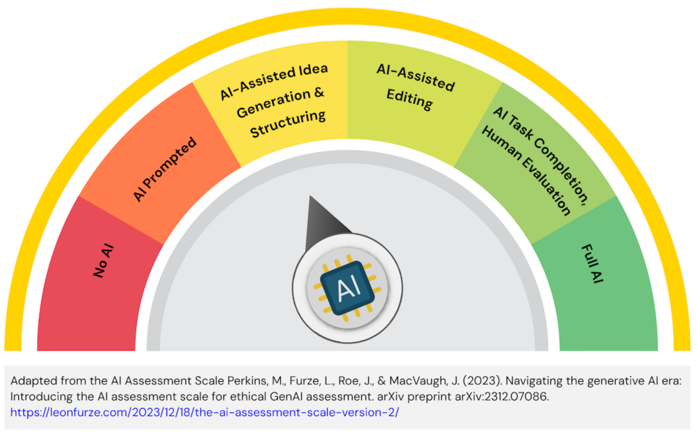

# COMP9030 Cycle 01 UX Design

Return to Assessment Overview [README.md](../../README.md)

> [!IMPORTANT]
> All information presented here should be read within the context of the project for the semester.\
> You can find the project description in Module 1 of the FLO site.

#### TL;DR

Due date: **Registered Tutorial Session Week 5**\
Submission artefacts:

- User Personas
- User Flows
- Wireframes
- Design Rationale Document

## Requirements

You will define the user experience and interface design for your web application, focusing on user needs and usability principles. This will be an oral presenation of the work carried out by the team during your registered tutorial session. You will need to create a Markdown (for Markdown syntax, see this [linked page](https://docs.github.com/en/get-started/writing-on-github/getting-started-with-writing-and-formatting-on-github/basic-writing-and-formatting-syntax)) report that identifies a clear purpose for the website, demonstrates an understanding of who the target users are, define the scope and structure of the website, and create initial low-fidelity designs. This will be the initial plan for the website you will implmenent in the next phase of the assignment.\
The report your create will be the output generated from the user research activities that you and your team members execute.
You will present the key aspects of this report live, during your tutorial. You will not need to create an Powerpoint to demonstrate these concepts, instead you should use your report and other artefacts to highlight the work of the team.

### Deliverables

1. User Personas (at least 2): Detailed descriptions of your target users, including their goals, needs, behaviors, and pain points related to your application's theme.
2. User Flows (3 key flows): Visual representations of the paths users will take to complete specific tasks within your application (e.g., "User registers and logs in," "User browses products and adds to cart").
3. Wireframes (Key Pages): Low-fidelity visual representations of your application's layout and content organization. Focus on structure and functionality, not aesthetics. Include annotations explaining interactive elements.
4. Design Rationale Document: A written document explaining your design choices, how they address user needs (as identified in your personas), and how they align with usability principles. Justify your decisions for layout, navigation, and interaction patterns.

### Oral Presentation Focus:

- Clearly articulate your understanding of the target users and their needs.
- Present your user flows and explain the rationale behind them.
- Demonstrate your wireframes and mockups, explaining the design decisions for key pages and interactions.
- Justify how your design choices contribute to a positive user experience and address the project theme.

### Learning Outcomes

The Cycle 01 submission addresses the following topic learning outcomes:

1. Determine how human factor principles and system design affects usability
2. ~~Implement user focused software solutions through the effective inclusion of users in the design and development process~~
3. Appraise human factors research methods for consideration in the planning of user-centric design practices
4. Reflect on ethical, legal and security issues related to web applications
5. Practically apply user-centric, iterative design practices incorporating rapid feedback integration
6. ~~Prepare, conduct and evaluate user experience experiments for interactive, web-based systems~~
7. Work independently and in a team on designing, creating and maintaining applications for the web
8. Communicate effectively, using technical language with other IT professionals

### Assessment and Submission

Your submission will be assessed on the quality and completeness of the presentation of your design ideas, as well as the document, the comprehensive consideration for the various components and proposed site structures, as well as your creativity and the ability to document and present a believable user persona, and present effective designs for page elements of your site. The submission should be visually appealing and engaging, remember that these types of documents are intended to be visible and motivate the team to engage with their intended users.

#### Marking Rubric

| Criteria | HD (85-100%) | DN (75-84%) | CR (65-74%) | P (50-64%) | F (0-49%) |
| --- | --- | --- | --- | --- | --- |
| User Personas | Comprehensive, insightful, and clearly articulate deep understanding of user needs, consistently and effectively informing all design decisions. Personas are highly detailed, evidence-based, and demonstrate exceptional empathy for target users. | Well-defined and generally inform design decisions effectively. Personas are detailed and mostly evidence-based, demonstrating a good understanding of user needs and influencing design choices appropriately. | Adequate and somewhat inform design decisions. Personas are present with some detail, showing a basic understanding of user needs and some relevance to design choices. | Basic or incomplete, with limited relevance to design. Personas are vague, lack sufficient detail, or show only a superficial understanding of user needs, with minimal impact on design. | Lacking, irrelevant, or significantly inadequate. Personas are missing, or demonstrate a poor or no understanding of target users, failing to inform design decisions. |
| User Flows | Exceptionally clear, logical, and thoroughly cover all critical user journeys with optimal efficiency and user-centricity. Flows demonstrate a sophisticated understanding of user pathways and potential interactions, with no ambiguity. | Clear and logical, effectively covering all main user journeys. Flows are easy to follow and represent typical user interactions, with only minor areas for improvement in efficiency or clarity. | Mostly clear and logical, covering basic user journeys. Flows are understandable but may lack detail or efficiency in some areas, or only cover the most fundamental user pathways. | Partially unclear or incomplete, covering only limited user journeys. Flows may be difficult to follow in places, contain ambiguities, or omit key steps in user interactions. | Unclear, disorganized, or significantly incomplete. User flows are incomprehensible, illogical, or entirely missing, failing to illustrate user journeys. |
| Wireframes | Excellently structured, meticulously annotated, and flawlessly communicate layout, hierarchy, and interactive elements. Wireframes are highly professional, demonstrating exceptional attention to detail and adherence to usability principles. | Well-structured with clear annotations, effectively communicating layout and interactive elements. Wireframes are professional and easy to understand, with strong attention to detail. | Adequately structured with sufficient annotations, communicating the basic layout. Wireframes are understandable but may lack some refinement in structure or detail, or annotations are not consistently clear. | Basic structure with limited or inconsistent annotations, communicating a vague layout. Wireframes may be difficult to interpret, lack necessary detail, or have inconsistent annotations. | Poorly structured, unannotated, or illegible. Wireframes are unusable or fail to convey any meaningful information about the application's layout or functionality. |
| Design Rationale | Comprehensive and insightful, thoroughly explaining and robustly justifying all design choices based on a deep understanding of user needs, usability principles, and project goals. Arguments are compelling and evidence-based. | Thoroughly explains and justifies most design choices based on user needs, usability principles, and project goals. Arguments are logical and supported with good reasoning. | Clearly explains some design choices with adequate justification based on user needs or usability. Some connections to principles and user needs are made, but not consistently or deeply. | Briefly explains some design choices with limited or unclear justification. Explanations may be superficial, lack supporting arguments, or show a weak connection to user needs or usability principles. | Lacks explanation or justification for design choices, or demonstrates a misunderstanding of user needs/usability. The rationale is absent, illogical, or provides no meaningful insight into the design process. |
| Oral Presentation | Highly engaging, articulate, exceptionally well-organized, and confidently conveys a deep understanding of the design process and outcomes. Presentation is compelling, professional, and demonstrates mastery of the subject matter. | Engaging, clear, and well-organized, confidently articulating the design process and outcomes. Presentation flows smoothly, effectively conveying key information and demonstrating good command of the topic.  | Clear and understandable, with adequate organization, articulating the design. Presentation is generally coherent but may have some minor areas for improvement in organization, clarity, or confidence. | Understandable, but may lack organization, clarity, or confidence. Presentation may be somewhat rambling, difficult to follow at times, or delivered without conviction. | Unclear, disorganized, or difficult to follow. Presentation is confusing, lacks structure, or fails to effectively communicate the design or rationale. |

The work you submit should adhere to the guidelines presented here.\
Late submission of your work will incur a 5% penalty of the total marks possible per day (or part thereof) late. Submission will not be accepted 5 days after the due date.\
The Cycle 1 Report is worth 10% of the overall marks for the topic.

### Academic Integrity Advisory

For this assessment task, students can use Artificial Intelligence (AI) in the development of their submission. Students are permitted to use AI to brainstorm ideas or provide ideas on structuring of documents. They cannot create written content using AI (e.g. sentences, paragraphs, etc.). Students are required to provide AI prompts used and drafts of their work and acknowledge how they used AI in their final submission.

#### How should the use of AI be acknowledged in the assessment task?

Students must submit a separate document with their video pitch. The document should provide a declaration acknowledging which AI technologies have been used and how. Drafts should be kept demonstrating authorship and may be requested by assessors. An appendix containing all prompts and output generated from AI should be included with the final submission.

For example:

- I acknowledge the use of ChatGPT in the early stages of brainstorming the research ideas for this project (OpenAI, Year). The prompts and output from ChatGPT are included in Appendix A.

A reference to the use of AI should be included in the reference list.

For example:

- (Year). ChatGPT (Month, Year, Version) [Large language model]. https://<!--comments-->chat.openai.<!--comment-->com/chat

**Academic Integrity**\
The misuse of generative AI or the failure to acknowledge the use of generative AI will be considered a breach of [Academic Integrity](https://students.flinders.edu.au/my-course/academic-integrity).

All work submitted should be the work of the authors, unless appropriately cited. Claiming work that is not your own is a breach of the University’s Academic Integrity Policy and suspected breaches will be reviewed and reported where appropriate. Penalties for breaches can range from 0 marks for the assignment, 0 marks for the topic, or expulsion from the University.
