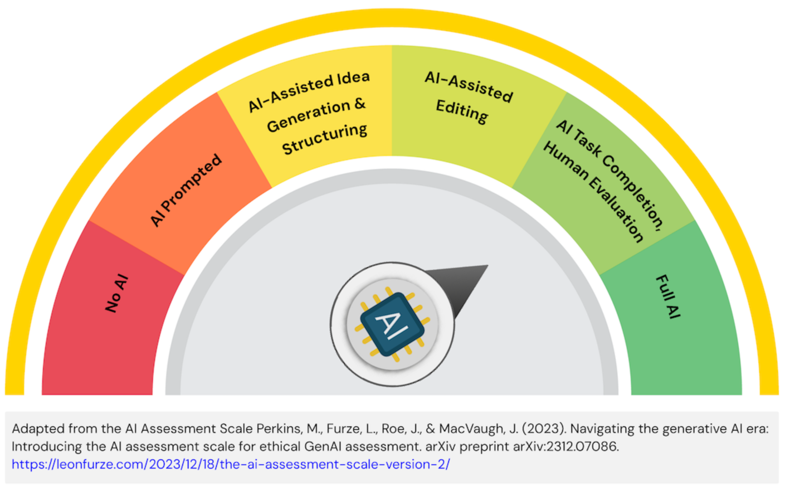

# COMP9030 Cycle 02

Return to Assessment Overview [README.md](../../README.md)

> [!IMPORTANT]
> All information presented here should be read within the context of the project for the semester.\
> You can find the project description in Module 1 of the FLO site.

#### TL;DR

Due date: **Registered Tutorial Session Week 8**\
Submission artefacts:

- Semantic HTML5
- CSS Styling
- JavaScript

## Requirements
To implement the static frontend of your web application using HTML, CSS, and JavaScript, bringing your UX design to life as a functional prototype.  

You will need to demonstrate key interactivity and linkage between pages.  Where necessary dummy data or placeholder pages can be used to simulate backend interactivity.

### Deliverables
1. Complete HTML Structure: All planned pages of your application implemented using semantic HTML5.
1. Comprehensive CSS Styling: All pages styled according to your mockups and general design theme, ensuring a visually appealing and consistent user interface.  This include responsive design principles to ensure usability across different screen sizes (e.g., mobile, tablet, desktop).
1. Client-Side Interactivity: Implementation of interactive elements identified in your UX design (e.g., navigation menus, form validations, image carousels, dynamic content without server interaction).
1. Source Code: All HTML, CSS, and JavaScript files, well organised and commented.

### Oral Presentation Focus

- Demonstrate the navigation between different pages of your site.
- Showcase the visual design and consistency across all pages.
- Highlight and explain the interactive elements implemented using JavaScript.
- Demonstrate the responsiveness of your design across simulated screen sizes.
- Discuss and challenges encountered and how you addressed them.

### Learning Outcomes

The Cycle 01 submission addresses the following topic learning outcomes:

1. Determine how human factor principles and system design affects usability
2. Implement user focused software solutions through the effective inclusion of users in the design and development process
3. Appraise human factors research methods for consideration in the planning of user-centric design practices
4. Reflect on ethical, legal and security issues related to web applications
5. Practically apply user-centric, iterative design practices incorporating rapid feedback integration
6. ~~Prepare, conduct and evaluate user experience experiments for interactive, web-based systems~~
7. Work independently and in a team on designing, creating and maintaining applications for the web
8. Communicate effectively, using technical language with other IT professionals

### Assessment and Submission

Your submission will be assessed on the quality and completeness of the presentation of your frontend solution, as well as the quality of the code solution implemented. The submission should be visually consistent with the UX Design from Cycle 1, but should enhance the features with suitable brand colour choices, images, and themes.

#### Marking Rubric

| Criteria | HD (85-100%) | DN (75-84%) | CR (65-74%) | P (50-64%) | F (0-49%) |
| --- | --- | --- | --- | --- | --- |
| HRML Structure | Exemplary semantic HTML5, perfectly organized, and flawlessly reflects content hierarchy and accessibility best practices. The structure is highly maintainable and scalable. | Strongly semantic and well-organized HTML, accurately reflecting content hierarchy. Structure is clear, logical, and easy to navigate. | Mostly semantic HTML with good organization. The structure is generally clear but may have minor inconsistencies or opportunities for improvement in semantic usage. | Basic HTML structure with some organization issues or limited semantic usage. The code may be somewhat difficult to follow or could benefit from better structuring for content hierarchy. | Poorly structured or significantly incomplete HTML. The code is disorganized, difficult to read, or lacks essential structural elements, rendering the prototype largely dysfunctional. |
| CSS Styling | Outstanding visual consistency, exceptional aesthetic appeal, and fully responsive design across all tested screen sizes without flaws. Styling is sophisticated, efficient, and adheres strictly to mockups while demonstrating creativity and best practices. | Highly consistent and responsive styling, with strong visual design that closely aligns with mockups. Design adapts well to various screen sizes, exhibiting good aesthetic choices. | Good consistency and basic responsiveness, with acceptable visual design. The styling generally follows mockups but may have minor inconsistencies or areas where responsiveness could be further refined. | Some inconsistency in styling or limited responsiveness, with a basic visual design. The prototype may not fully adapt to different screen sizes, or the aesthetic quality is rudimentary and deviates noticeably from mockups. | Inconsistent, not responsive, or poor visual design. The prototype lacks visual cohesion, fails to adapt to different screen sizes, or is visually unappealing and does not reflect the mockups. |
| JavaScript Interactivity | All planned client-side interactions are implemented robustly, smoothly, and efficiently, providing an intuitive and seamless user experience. JavaScript code is clean, optimized, and error-free, enhancing usability significantly. | Most planned client-side interactions are implemented well, functioning smoothly with minor or no issues. The interactive elements enhance the user experience effectively. | Some client-side interactions are implemented; generally functional but may have minor bugs or limitations. The basic interactivity is present, but it may not always be smooth or comprehensive. | Few or non-functional client-side interactions, or significant issues prevent smooth operation. The prototype lacks expected interactivity, or the existing JavaScript causes noticeable errors or poor user experience. | Minimal or no functional client-side interactions implemented. The prototype is static, or JavaScript is entirely absent, fundamentally failing to meet the interactivity requirements. |
| Adherence to UX Design | Frontend flawlessly translates all aspects of the mockups and user flows into code, demonstrating exceptional attention to detail and a profound understanding of the original design intent. The prototype is a perfect digital realization of the UX design. | Frontend accurately translates most elements of the mockups and user flows into code, with strong alignment to the original design. The prototype largely reflects the UX design effectively. | Frontend shows good resemblance to mockups and user flows, with some minor deviations. The core elements of the UX design are present, but there may be small discrepancies. | Frontend shows some resemblance to mockups/flows but with noticeable deviations. Key elements of the UX design may be misinterpreted or omitted, impacting the intended user experience. | Significant deviations from UX design. The prototype bears little resemblance to the original mockups or user flows, failing to implement the intended user experience. |
| Code Quality | Exceptional code quality: clean, meticulously commented, highly efficient, and adheres flawlessly to best practices and coding standards. The codebase is highly maintainable, scalable, and a pleasure to review. | High-quality code: well-commented, generally efficient, and follows most best practices consistently. The codebase is readable and well-structured. | Good code quality: some comments, minor inefficiencies, and mostly follows practices. The code is understandable but could benefit from more consistent application of best practices. | Acceptable code quality: some comments but with noticeable inefficiencies or inconsistent practices. The code may be harder to read, maintain, or debug due to a lack of consistent standards or optimization. | Poorly commented, inefficient, or difficult to understand. The codebase is disorganized, lacks comments, contains significant errors, or is not in a state that allows for effective review or future development. |
| Oral Presentation | Highly engaging, delivers a clear and compelling demonstration, and confidently articulates a sophisticated understanding of technical implementation, design choices, and challenges. The presentation showcases mastery of the prototype and its underlying technologies. | Clear and organized demonstration, effectively explaining the technical implementation and design choices. The presenter articulates concepts well and handles questions confidently. | Understandable demonstration with a basic explanation of implementation details. The presenter covers the main points but may lack depth in technical explanation or confidence in delivery. | Demonstration is somewhat unclear or the explanation of implementation is limited. The presenter may struggle to convey key technical aspects or demonstrate the prototype effectively. | Unclear demonstration or unable to explain implementation. The presentation is confusing, incomplete, or the presenter cannot articulate the technical aspects of the prototype. |

The work you submit should adhere to the guidelines presented here.\
Late submission of your work will incur a 5% penalty of the total marks possible per day (or part thereof) late. Submission will not be accepted 5 days after the due date.\
The Cycle 2 Frontend site is worth 15% of the overall marks for the topic.

### Academic Integrity Advisory



For this assessment task, students are permitted to use AI for some or most elements of the task and demonstrate effective use of AI. They are expected to evaluate output irrespective of how it is attained, include all prompts and output in an appendix, and acknowledge and cite AI created content in their final submission.

#### How should the use of AI be acknowledged in the assessment task?

Students must provide a declaration acknowledging which AI technologies have been used and how (add a file to the `cycle2` folder, named `AI-acknowledgement.md`). Drafts should be kept demonstrating authorship and may be requested by assessors. The `AI-acknowledgement.md` file should contain all prompts and output generated from AI, and must be included with the final submission.

For example (start the `AI-Acknowledgement.md` file with the following statement):

- I acknowledge the use of ChatGPT in generating content included in this submission (OpenAI, Year). The prompts and output from ChatGPT are included in the file below.

A reference to the use of AI should be included in the reference list.

For example:

Within your reports: 

- (Year). ChatGPT (Month, Year, Version) [Large language model]. https://<!--comments-->chat.openai.<!--comment-->com/chat

Within your code:
- Immediately after lines of final code in your project where you have used AI to improve your work:
```
#-# START COMMENT BLOCK #-#
AI Tool used
Line number in AI-Acknowledgement.md where you captured this work
Your personal interpretation of the response from genAI - comment on what it means to you
#-# END COMMENT BLOCK #-#
```

**Academic Integrity**\
The misuse of generative AI or the failure to acknowledge the use of generative AI will be considered a breach of [Academic Integrity](https://students.flinders.edu.au/my-course/academic-integrity).

All work submitted should be the work of the authors, unless appropriately cited. Claiming work that is not your own is a breach of the University’s Academic Integrity Policy and suspected breaches will be reviewed and reported where appropriate. Penalties for breaches can range from 0 marks for the assignment, 0 marks for the topic, or expulsion from the University.
